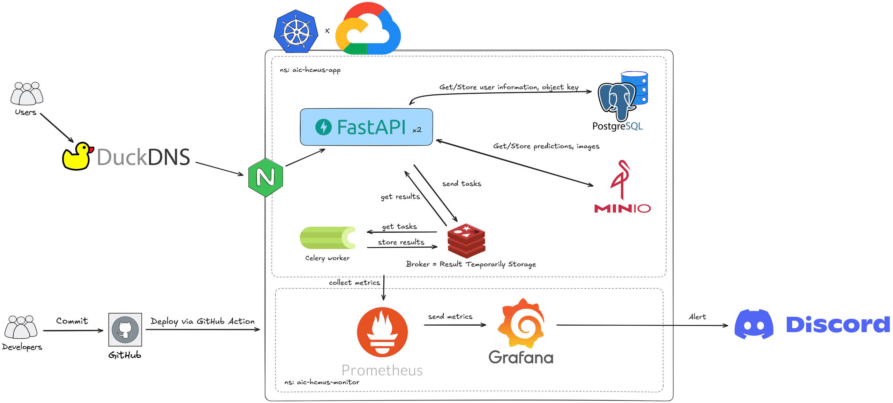

# AIC-HCMUS Fragment Segmentation Application Summary

## Overview
This application is a full-stack solution for fragment segmentation, built for the HCMUS AI Challenge. It includes a **React frontend**, a **FastAPI backend**, and supporting services like **PostgreSQL**, **MinIO**, **Celery worker**, **Redis**, and **NGINX**. **Grafana** and **Prometheus** have been added to this app for observation and alerting to Discord. The application is containerized using **Docker** and orchestrated with **Kubernetes** for deployment. This project contains a pipeline to automatically deploy the app to Google Kubernetes Engine (GKE).

---

## System Architecture


---

## Folder Structure
```
.
├── backend              # Backend, built with FastAPI
│   ├── app              # Main application directory
│   │   ├── models       # Database models and queries
│   │   ├── predict      # Celery tasks for background processing
│   │   ├── routers      # API endpoint routers
│   │   ├── scripts      # Backup scripts for database and MinIO
│   │   └── utils        # Helper modules (security, MinIO, YOLO integration)
├── docs                 # Documentation files
├── frontend             # Frontend, built with React and TypeScript
│   ├── public           # Public assets (images, icons, etc.)
│   ├── src              # Source code for the frontend
│   │   ├── components   # Reusable UI components
│   │   ├── context      # Context for state management
│   │   ├── lib          # Utility functions
│   │   └── services     # API communication logic
├── grafana              # Grafana configuration for monitoring
├── k8s                  # Kubernetes YAML files for deployment
├── tests                # Testing and load test scripts
└── notebooks            # Jupyter notebooks for experimentation
```

---

## Key Features
1. **Frontend**:
   - Built with **React** and **TypeScript**.
   - Uses **TailwindCSS** for styling.
   - Implements **React Router** for navigation.
   - Provides manual user authentication (login/register) and OAuth2 to use Google Account for login.
   - Allows users to upload images, view predictions, and visualize results (e.g., overlaid masks, **Equivalent Diameter (ED)** chart).
   - Users can see their previous images and download them.

2. **Backend**:
   - Built with **FastAPI**.
   - Handles user authentication with JWT tokens.
   - Provides endpoints for image upload, prediction, and fetching results.
   - Integrates with **YOLOv11m** for segmentation and particle size calculation.
   - Stores metadata and predictions in **PostgreSQL**.
   - Uses **MinIO** for object storage (e.g., images, binary masks).
   - Uses **Celery** for asynchronous task processing (e.g., running predictions in the background) with **Redis** as the message broker.
   - **Prometheus** is used for monitoring metrics.
   - **Grafana** is used for dashboard visualization and alerting.
   - **Grafana alerts** are configured to send notifications to **Discord**.

3. **Machine Learning**:
   - The app uses a YOLOv11m segmentation model. This model has been fine-tuned on the Rock Fragment Dataset. The backend will download it from [Hugging Face](https://huggingface.co/magnusdtd/aic-hcmus-2025-yolo11m-seg).
   - Detects calibration objects (red balls) to convert pixel values to real-world values.
   - Generates overlaid masks and draws a CDF chart of the ED distribution.

4. **Infrastructure**:
   - **Docker Compose** for local development.
   - **Kubernetes** manifests for deployment (app, PostgreSQL, MinIO, NGINX).
   - CI/CD pipeline using **GitHub Actions** to build and deploy to **Google Kubernetes Engine (GKE)**.
   - Uses a Celery worker and **Redis** as the message broker for task queuing.
   - **Prometheus** and **Grafana** for monitoring and alerting.
   - **DuckDNS** is used to provide a public domain for accessing the application after deployment on Google Cloud.

---

## Deployment Workflow
1. **Local Development**:
   - Use `docker-compose.yml` to spin up services locally.
   - The app runs on `https://localhost:443`.

2. **CI/CD Pipeline**:
   - Triggered on `deploy` branch push.
   - Builds Docker images and pushes them to **Google Container Registry (GCR)**.
   - Deploys to **Google Kubernetes Engine (GKE)** using Kubernetes manifests.

3. **Production Deployment**:
   - The app services are deployed in the `aic-hcmus-app` namespace, and the monitoring services are deployed in the `aic-hcmus-monitor` namespace.
   - NGINX serves as a reverse proxy and load balancer for the frontend and backend.

---

## Technologies Used
- **Frontend**: React, TypeScript, TailwindCSS, Vite.
- **Backend**: FastAPI, SQLModel, MinIO, YOLOv11m-seg, Celery.
- **Database**: PostgreSQL.
- **S3 Storage**: MinIO.
- **Task Queue**: Celery with Redis as the message broker.
- **Containerization**: Docker.
- **Orchestration**: Kubernetes.
- **CI/CD**: GitHub Actions.
- **Cloud**: Google Kubernetes Engine (GKE).

---
For more details about this application, please read the [documentation page](https://magnusdtd.github.io/AIC-HCMUS-Fragment-Segmentation/).