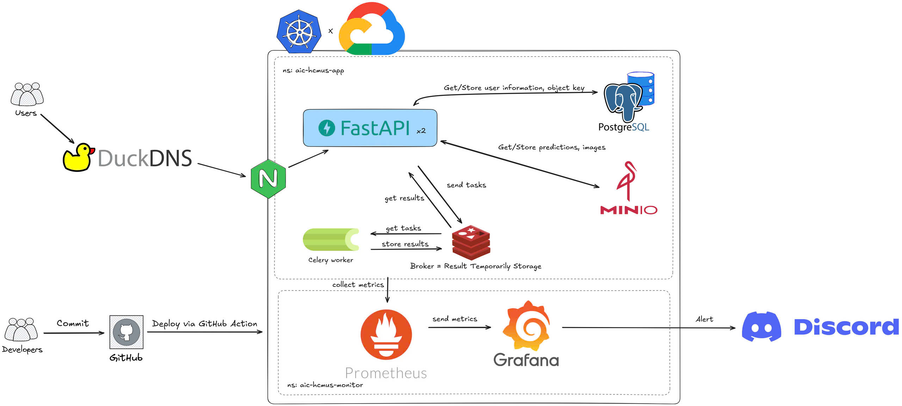

# 🚀 AIC-HCMUS Fragment Segmentation

Welcome to **AIC-HCMUS Fragment Segmentation**—your all-in-one solution for analyzing and reconstructing document fragments and broken objects. Powered by cutting-edge computer vision and deep learning, our platform delivers precise, reliable results for fragment segmentation and equivalent diameter estimation.

---

## ✨ Features at a Glance

### 🖥️ Frontend
- Modern UI built with **React** & **TypeScript**
- Stylish layouts using **TailwindCSS**
- Seamless navigation via **React Router**
- Secure user authentication (login/register)
- Effortless image upload, prediction, and result visualization (overlaid masks, equivalent diameter data)

### ⚡ Backend
- Fast, scalable API with **FastAPI**
- JWT-based authentication
- Endpoints for uploading images, running predictions, and retrieving results
- Integrated with **YOLOv11m** for segmentation & equivalent diameter calculation
- Data stored in **PostgreSQL**; images & masks in **MinIO**

### 🤖 Machine Learning
- State-of-the-art **YOLOv11m** segmentation model
- Automatic calibration object detection (e.g., red balls) for accurate equivalent diameter estimation
- Generates overlaid masks and computes object equivalent diameters

### ☁️ Infrastructure
- **Docker Compose** for easy local setup
- **Kubernetes** manifests for scalable deployment (PostgreSQL, MinIO, app, NGINX)
- Automated CI/CD with **GitHub Actions**—deploys straight to Google Kubernetes Engine (GKE)

## 🗺️ System Architecture

