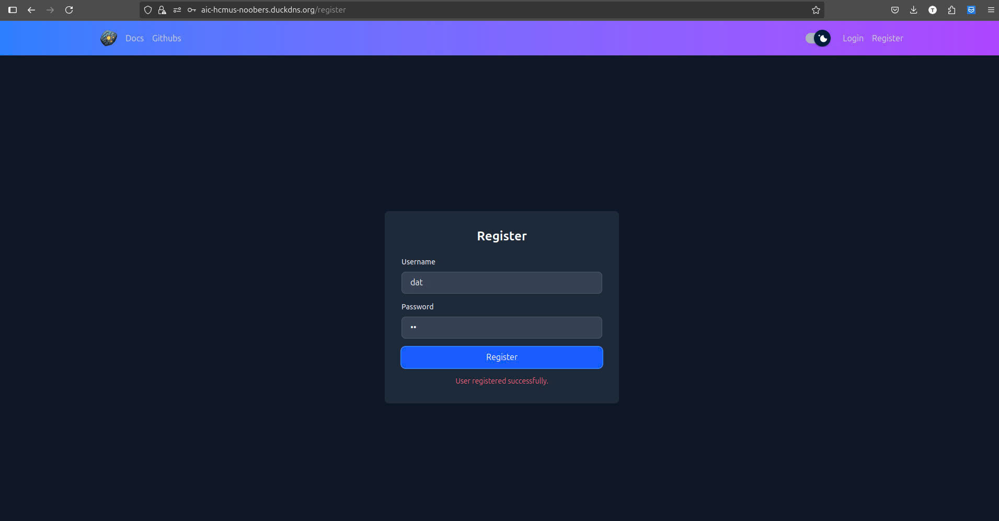

# Usage Guide

This guide explains how to use the AIC-HCMUS Fragment Segmentation application, from setup to making predictions.

---

## 1. Prerequisites

- Docker and Docker Compose installed
- Modern web browser (for frontend)
- (Optional) Python 3.10+ and Node.js

---

## 2. Running the Application

### Using Docker Compose

1. Clone the repository:
   ```sh
   git clone https://github.com/magnusdtd/AIC-HCMUS-Fragment-Segmentation.git
   cd AIC-HCMUS-Fragment-Segmentation
   ```
2. Create nginx SSL certificate:
   - Generate a self-signed SSL certificate (openssl is required):
     ```sh
     mkdir -p nginx-ssl
     openssl req -x509 -nodes -days 365 -newkey rsa:2048 \
       -keyout nginx-ssl/tls.key \
       -out nginx-ssl/tls.crt \
       -subj "/C=US/ST=State/L=City/O=Organization/OU=Unit/CN=localhost"
     ```

3. Update the GOOGLE_CLIENT_ID and GOOGLE_CLIENT_SECRET in `docker-compose.yml` if you want to use your credential.

4. Start all services:
   ```sh
   docker compose up --build
   ```

4. Access the frontend at [http://localhost:443](http://localhost)  

---

## 3. App Features

### Register
- Open the web app.
- Press the register button to navigate to the register page.
- Enter your username and password.
- The page will automatically redirect to the default page.



### 2. Login

#### 2.1. Manual login


#### 2.2. Google Login


### 3. Upload and Predict on an Image

- After logging into the app, navigate to the predict tab.

- Upload an image file (e.g., a fragment image).
- Adjust the values for real radius, unit, confidence (conf), or Intersection over Union (iou) if needed.
- Submit to receive segmentation results.


### 4. View Uploaded Images

- The images tab contains all user-uploaded images.

- Click on each image to see its details.

- Use the view button to see prediction details and the download button to download artifacts.

---

For further help, see the [About](about.md) page or open an issue on GitHub.