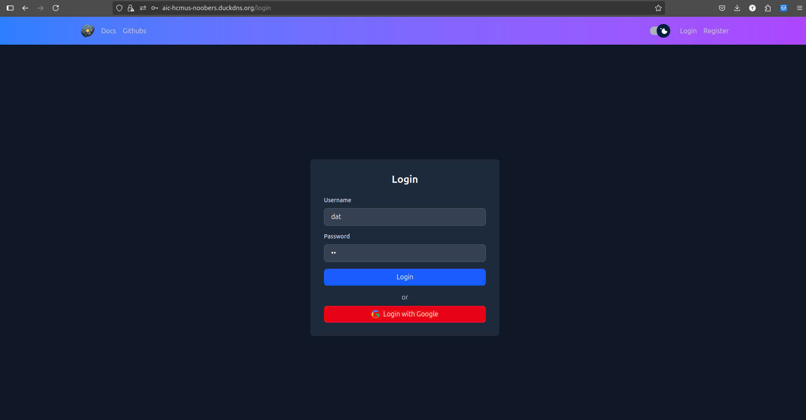
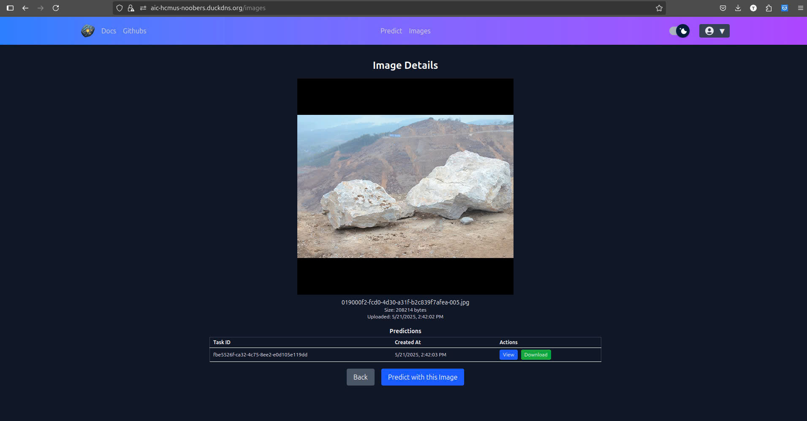

# Hướng Dẫn Sử Dụng

Hướng dẫn này giải thích cách sử dụng ứng dụng Phân Đoạn Mảnh Vỡ AIC-HCMUS, từ cài đặt đến dự đoán.

---

## 1. Yêu Cầu Trước

- Đã cài đặt Docker và Docker Compose
- Trình duyệt web hiện đại (cho giao diện frontend)
- (Tùy chọn) Python 3.10+ và Node.js

---

## 2. Khởi Động Ứng Dụng

### Sử Dụng Docker Compose

1. Clone mã nguồn:
   ```sh
   git clone https://github.com/magnusdtd/AIC-HCMUS-Fragment-Segmentation.git
   cd AIC-HCMUS-Fragment-Segmentation
   ```
2. Tạo chứng chỉ SSL cho nginx:
   - Generate a self-signed SSL certificate (openssl is required):
     ```sh
     mkdir -p nginx-ssl
     openssl req -x509 -nodes -days 365 -newkey rsa:2048 \
       -keyout nginx-ssl/tls.key \
       -out nginx-ssl/tls.crt \
       -subj "/C=US/ST=State/L=City/O=Organization/OU=Unit/CN=localhost"
     ```

3. Khởi động tất cả các dịch vụ:
   ```sh
   docker compose up --build
   ```

4. Truy cập giao diện frontend tại [http://localhost:443](http://localhost)  

---

## 3. Các Tính Năng Ứng Dụng

### Đăng Ký
- Mở ứng dụng web.
- Nhấn nút đăng ký để chuyển đến trang đăng ký.
- Nhập tên người dùng và mật khẩu của bạn.
- Trang sẽ tự động chuyển hướng đến trang mặc định.


### 2. Đăng Nhập

#### 2.1. Đăng Nhập Thủ Công



#### 2.2. Đăng Nhập Bằng Google


### 3. Tải Ảnh Lên và Dự Đoán

- Sau khi đăng nhập vào ứng dụng, chuyển đến tab dự đoán.

- Tải lên một tệp ảnh (ví dụ: ảnh mảnh vỡ).
- Điều chỉnh các giá trị bán kính thực, đơn vị, độ tin cậy (conf), hoặc Intersection over Union (iou) nếu cần.
- Gửi để nhận kết quả phân đoạn.


### 4. Xem Ảnh Đã Tải Lên

- Tab ảnh chứa tất cả các ảnh đã tải lên của người dùng.

- Nhấn vào từng ảnh để xem chi tiết của ảnh.

- Sử dụng nút xem để xem chi tiết dự đoán và nút tải xuống để tải các tệp kết quả.

---

Để được hỗ trợ thêm, xem trang [Giới Thiệu](about.md) hoặc tạo issue trên GitHub.